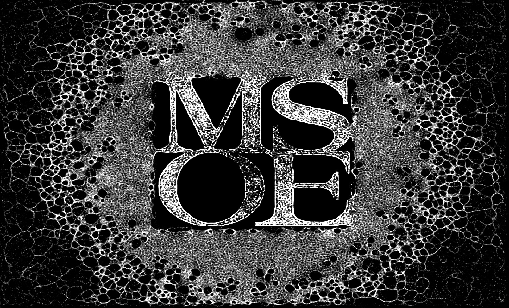

# GPU Programming Final Project: CUDA C Slime Simulation

## Milwaukee School of Engineering | MS Machine Learning | IS: GPU Programming

**Student:** Jonny Keane

**Advisor:** Sebastian Berisha

## Abstract

In this project, I implement a slime mold simulation in CUDA C that can be parallelized on a NVIDIA GPU. Slime molds are simple organisms that work effectively in colonies. Each particle has simple rules that dictate where to move and where to deposit chemoattract trails, so that other particles can choose to follow down explored paths. In the final state of this project, I achieve a kernel that can run 1 million particle threads operating in parallel and create a real time video feed that illustrates the evolution of the chemoattractant trails. Frames are rendered directly from GPU memory using the CUDA GL interop. Beyond this, I explored the use of blockers in the environment, food trails, and different hyperparameters for slime particle functionality to create an environment that allows for using an image as a food source, so slime particles may learn to converge to a state that takes on the shape of the given image.

