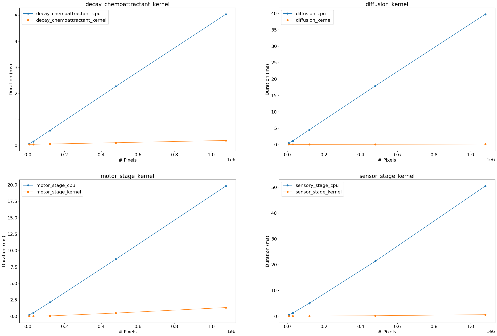
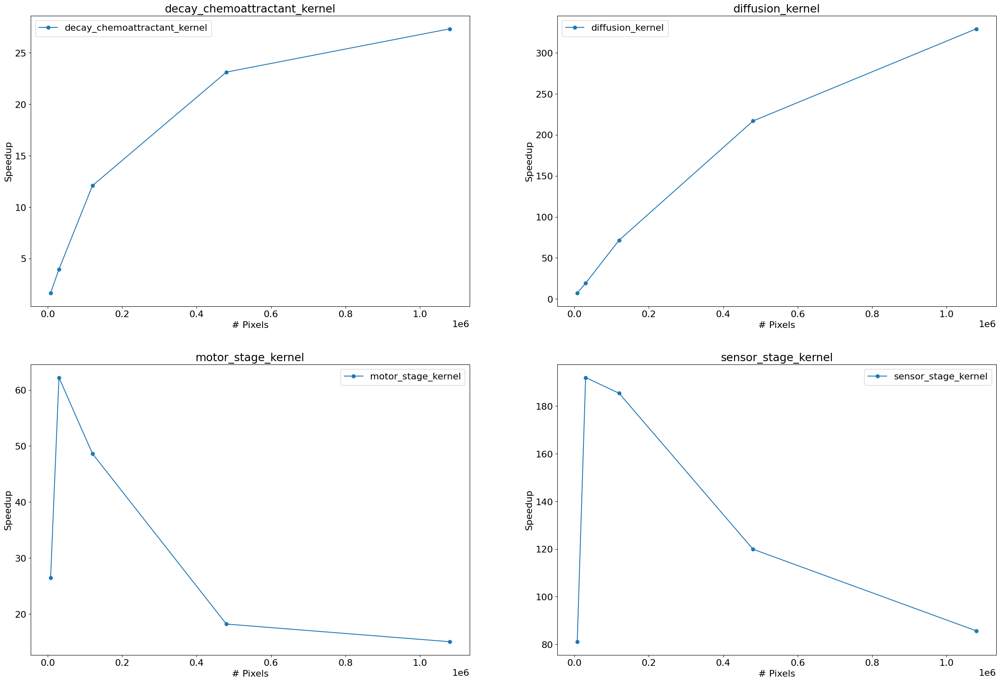

# GPU Programming Final Project: CUDA C Slime Simulation

## Milwaukee School of Engineering | MS Machine Learning

### IS: GPU Programming | Fall Semester 2024

**Student:** Jonny Keane

**Advisor:** Dr. Sebastian Berisha

## Abstract

In this project, I implement a slime mold simulation in CUDA C that can be parallelized on a NVIDIA GPU. Slime molds are simple organisms that work effectively in colonies. Each particle has simple rules that dictate where to move and where to deposit chemoattract trails, so that other particles can choose to follow down explored paths. In the final state of this project, I achieve a kernel that can run 1 million particle threads operating in parallel and create a real time video feed that illustrates the evolution of the chemoattractant trails. Frames are rendered directly from GPU memory using the CUDA GL interop. Beyond this, I explored the use of blockers in the environment, food trails, and different hyperparameters for slime particle functionality to create an environment that allows for using an image as a food source, so slime particles may learn to converge to a state that takes on the shape of the given image. In addition to this, I also explore the use of having the particles leaving chemical trails of different colors based on different food sources they have consumed, which allowed for an even more interesting graphic to be created.


An example of using different types of food to color the chemical trails of the particles.


An example of having food on the map for the particles to strive for, while also having dead regions that they cannot get to the food from. This code can be found on the `food` branch of the repository.

## Implementation

The behavior that is captured in this simluation is inspired by the slime-mold algorithm defined in [this paper](https://uwe-repository.worktribe.com/output/980579). There are four key components in the implementation and one additional piece that was added by me for getting the MSOE logo graphic seen in the above screenshots:

- *Sensory Stage*: Particles takes in the chemical trail to the left/right of the particle by an angle *SA* and in front of the particle. Particle then changes its trajectory based on the chemical trail it senses.

- *Motor Stage* - If the particle can move to its next location (not occupied by another particle), advance to the location and deposit the chemical trail.

    - *Food-Based Chemical Trail Deposits* - Inspired by how some animals take on different colors based on their diets (such as flamingos), the slime deposits chemical trails only when it has consumed food, and the chemical trails will take on different colors based on the "type" of food that was recently consumed by the particle.

    - *Dead Zones* - On the `food` branch, there is usage of "deadzones" to limit slime particles from going to certain regions of the environment.

- *Diffusion* - Uses a convoultion kernel (essentially a mean/blur filter) that distributes the chemical trail outward from its current location. This is essentially for getting slime particles to start creating more of a branching pattern when moving.

- *Decay Chemoattractant* - Decays the chemical trail in the environment by a fixed amount per timestep.

### Particle Kernels: Sensory Stage + Motor Stage

Both tasks can be parallelized because the same operations occur for every slime particle. The main point of nuance for these kernels is that part of this algorithm includes that particles cannot move in the motor stage to already occupied cells. To address this, atomic operations are used to mark a cell as occupied. These atomic operations return the prior value of the location getting the atomic applied on it, which can be used as a way to check if the particle is trying to move to an occupied cell, even if there are race conditions for a cell. The first to access in a race condition is not important. The only thing that matters is tha one particle occupies a cell at a given time, which atomic operations solve.

### Environment Kernels: Diffusion + Decay Chemoattractant

Since both tasks involve the same operations being applied to every cell in the environment, these taks once again can be parallelized. The decay chemoattractant kernel is very simple, but for the diffusion kernel, since this is essentially convolution with a specific kind of filter, a tiled approach can be used. In my implementation, I create the tiled implementation of convolution using halo cells that are loaded into shared memory (different from my implementation for lab 5, which relied on cacheing of global memory for halo cells), which makes sense because the current implementation does not have many halo cells with a filter radius of 1.

### CPU Implementation

The CPU implementation can be found in `slime_cpu.cu` (doesn't need to be CUDA file). It generates frame pictures in a `frames` subdirectory (you may need to create it if this is your first time running the CPU version). It can be compiled with the following:

```
nvcc slime_cpu.cu -o slime_cpu
```

It can be run with command:

```
./slime_cpu <ENV_HEIGHT> <ENV_WIDTH> <PERCENT_PARTICLES>
```

The exectuable itself has the following arguments:

- `<ENV_HEIGHT>` - integer for the height of the environment (default 1500)

- `<ENV_WIDTH>` - integer for the width of the environment (default 2000)

- `<PERCENT_PARTICLES>` - integer 0-100 for the percentage of slime particles(default 33)

### GPU Implementation: Using OpenGL

There are two older versions of CUDA C written for the GPU in `slime_gpu.cu` and `slime_gpu_gl.cu`, but the current version is in `slime_gpu_gl2.cu`. This implementation uses all the kernels described above, and it makes use of CUDA GL interop. You may need to packages `mesa-utils` and `freeglut3-dev` installed if you are running on your own PC for the first time. The OpenGL is used to create a window and define a `display()` function that is called for rendering each frame. This is used for performing the update steps in the slime simulation. 

## Running Code

### Running on ROSIE

***If you are on ROSIE***, things can be a little trickier because you first need to allocate a node with a GPU for doing the simulation/rendering, but then you need to do X11 forwarding back from the node through the SSH to ROSIE back to your laptop. Luckily, srun has some helpful arguments that you can work with to create this behavior.

1. Set up an X11 protocol server on your computer. 

    - *Linux*: An X11 server should be installed by default, but if not, you can install `xorg`

        ```
        sudo apt-get install xorg
        ```

    - *Windows*: There are two big sources for X11 servers on Windows. XMing and VcXsrv. I used VcXsrv because it apparently has more capabilities. You should download the server and X11 fonts package.

        - VcXsrv Download: https://sourceforge.net/projects/vcxsrv/

        - X11 Fonts Download: https://en.softonic.com/download/xming/windows/post-download

        Once these are downloaded, type in the command *XLaunch* and launch the server with all the default configurations.


2. Configure SSH config on your personal computer for ROSIE to allow X11 forwarding (if you have ROSIE in your SSH config, edit to include the missing lines).

    ```
    Host rosie
    XAuthLocation /usr/bin/xauth
    ForwardX11 yes
    ForwardX11Trusted yes
    HostName dh-mgmt2.hpc.msoe.edu
    User username
    ```

    X11 is a display protocol that is a little slow, so you won't be able to do a lot of fast frame-by-frame rendering for displays sent with the protocol, but it is a lightweight method of creating a display. Once this step is completed, X11 forwarding can be sent to your X11 server. You can test this by running `xclock` in the terminal connected to ROSIE.

3. Run setup script.

    ```
    source ./Setup_ROSIE.sh
    ```

    This creates the follwing in a temporary directory in ~/tmp:
    
    - `shared_libaries` directory that will be passed along for the executable to read from on the teaching node (contains `libglut.so.3` file)

    - `bin` directory with a `prime-run` executable that will be used in the srun command to call the executable with correct NVIDIA graphics configurations

    This also configures some environment variables (and places them in your ~/.bashrc):

    - `LD_LIBRARY_PATH` includes the files in ~/tmp

    - `PATH` includes the files in ~/bin (prime-run) and the path to the nvcc compiler on ROSIE

    - `XAUTHORITY` environment variable, which specifies the path to the X11 authentication file

3. Compile slime code with the following command:

    ```
    nvcc slime_gpu_gl2.cu slime_kernels.cu -L libs -o slimeGL -lGL -lGLU -lglut
    ```

    The extra arguments are needed for pulling in the OpenGL libraries.

4. Run the following srun command:

    ```
    srun -G 1 --x11 --export ALL --pty prime-run ./slimeGL <DISPLAY_MODE> <ENV_HEIGHT> <ENV_WIDTH> <PERCENT_PARTICLES>
    ```

     A little description of the arguments used here: 

     - `-G 1` - allocates a single GPU to be used

     - `--x11` - allows X11 display forwarding from node back to source node

     - `--export ALL` - uses all environment variables from source node in the target node

     - `--pty` - sends terminal output back to the shell

     - `prime-run ./slimeGL` - runs the `./slimeGL` executable with a series of presets to allow for correct NVIDIA graphics configuration

     The exectuable itself has the following arguments:
     
     - `<DISPLAY_MODE>` - The type of run to do as an integer. The options with their numerical codes are:

        - `BENCHMARK (0)` - benchmarking setup

        - `DISPLAY_RANDOM (1)` - display setup with random particle initialization

        - `DISPLAY_CIRCLE (2)` - display setup with circular pariticle intialization

        - `DISPAY_MSOE (3)` - display setup with MSOE logo shape and food coloring

     - `<ENV_HEIGHT>` - integer for the height of the environment (default 1500)

     - `<ENV_WIDTH>` - integer for the width of the environment (default 2000)

     - `<PERCENT_PARTICLES>` - integer 0-100 for the percentage of slime particles(default 33)

***Common Issues:***

- There may be cases where you see an X Error that looks something like this:

    ```
    X Error of failed request:  BadRequest (invalid request code or no such operation)
    Major opcode of failed request:  149 (GLX)
    Minor opcode of failed request:  187 ()
    Serial number of failed request:  45
    Current serial number in output stream:  45
    ```

    This seems to be the result of multiple users using the GLX context on the same GPU. While I don't know for sure, this may be because only one GLX context is allowed per GPU (or some issue with having too many accesses to the same graphics resources). If you wish to use specific nodes, you can add the argument `--nodelist dh-node12` which can be replaced with the node you wish to target.

- If this gives a weird error about SEGMENTATION faults on ROSIE, there are some cases where failed compilation can leave the GPUs in a weird state leading to this behavior. If you wish to use specific nodes, you can add the argument `--nodelist dh-node12` which can be replaced with the node you wish to target.

### Running on Personal PC

*Note:* You may need to packages `mesa-utils` and `freeglut3-dev` installed if you are running on your own PC for the first time.

1. On a computer with the nvcc compiler installed and having the glut libraries installed for using OpenGL (should most likely be preinstalled with CUDA driver), you can run the following command to compile:

    ```
    nvcc slime_gpu_gl2.cu slime_kernels.cu -L libs -o slimeGL -lGL -lGLU -lglut
    ```

2. If you have prime-run set up on your computer (as done above) with a GPU (see resources below for help setting up), you can run the code with the following command:

    ```
    prime-run ./slimeGL
    ```


## Benchmarking

To compare the CPU and GPU implementations, we evaluated 10 trials of the update steps for both implementations at 5 different image sizes. The number of particles was always 33% of the image size. With these benchmarks, there were four main kernels in the update steps. Two kernels (`diffusion` and `decay_chemoattractant`) were applied on the entire environment while the other two (`motor_stage_kernel` and `sensor_stage_kernel`) were applied on the array of particles. From the benchmark figure below, we can see that the CPU implementation of all kernels became slower than the GPU implementation as the envrionment size increased. The kernel that had the most latency difference was the diffusion kernel, which used a tiled kernel with shared memory to use the GPU very effectively.



If we look at the speedup that we achieved with each of the kernels, we see that for the kernels applied to the entire environment (top row), the speedup increases with the size of the environment, but does start to plateau. For the particle-based kernels, we saw that the speedup had a peek point for a smaller environment, but then started to drop off before plateauing for larger environments.



The one thing to note with the GPU implementation is that this implementation does have the display with OpenGL capabilties, which loads the display from GPU memory I believe, so this is a capability that goes beyond what the CPU implementation provides, allowing for a real-time video feed of the slime simulation.

### Recreating the Benchmarks

If you wish to recreate the benchmarks on ROSIE, you can do the following:

```
# setup for ROSIE (in the case that this hasn't been run before)
source ./Setup_ROSIE.sh

# runs the benchmarks
source ./benchmarks.sh
```

Then, you should be able to run the notebook `results_benchmarks.ipynb` (you may have to change the `DIR` variable at the top of the notebook to get the right path relative to your current directory) to create the figures above.

## Future Work

On the optimization side of this algorithm, one interesting thought suggested by Bart Gebka was that in the more elaborate slime simulations, particles will generally stay in the same neighborhood and have similar neighboring particles. With this, a potential point of optimization would be that if you could create an approach that keeps track of what "tile" the particles are in and maintain this through the simulation, you could potentially load the tile into shared memory that could be reused by the neighborhood of particles so that memory accesses are more often reaching into shared memory rather than global memory. This technique would be more important as you increase the size of sensor regions. 

The big thing that would be needed in creating this optimization would be some efficient way to resort the particles into their respective tiles. This might only need to be something that occurs periodically if it ends up being too much work to do on every update step, but this would be OK because particles should not change positions that rapidly, so periodic reorganization could still work.

With the addition of food coloring functionality, I think there is a really cool opportunity to extend this technique to an arbitrary image with arbitrary key colors. While I do not have a good resource for how to algorithmically create one of these, sites like [PBNify](https://pbnify.com/) seem to have a way of finding the blocks for specific colors once they are identified, so it seems feasible to be able to create a set of masks for each color. With this, you could abstract the current state of the code so that you can take any image, identify its key colors, create masks of these colors, and create a slime representation of the image.

## Resources

[Coding Adventure: Ant and Slime Simulations - YouTube](https://www.youtube.com/watch?v=X-iSQQgOd1A)

- This video was a main source of inspiration for doing this project. The experiments shown looked into a lot of other features such as use of different colors/species/hyperparameters.

[Characteristics of pattern formation and evolution in approximations of physarum transport networks](https://uwe-repository.worktribe.com/output/980579)

- This was a paper mentioned in the above video that talked about the specific implementation details of the slime particles. They also have a much more formalized exploration of different hyperparameters.

[NVIDIA - cuda-samples - GitHub](https://github.com/NVIDIA/cuda-samples)

- This repository has a lot of very helpful examples of doing different things in in CUDA. The main example I used in this project was from Samples/2_Concepts_and_Techniques/boxFilter, which was another visualization using the CUDA GL interop in a different application.

[prime-run Command Not Found - Stack Overflow](https://askubuntu.com/questions/1364762/prime-run-command-not-found)

- After executing the boxFilter code ended up not working, I found out I needed to use [prime-run](https://forums.developer.nvidia.com/t/getting-an-error-code-999-everytime-i-try-to-use-opengl-with-cuda/203769) command to run my executables with graphics code. I did not have this installed, however, but this Stack Overflow post helped me work through this.

[srun Documentation](https://slurm.schedmd.com/srun.html)

- There's a lot of arguments that I did not know about for getting the displaying working through a node with GPU allocated (namely the `--x11` argument for display forwarding and the `--export ALL` for exporting environment variables over to the environment used when running the command).